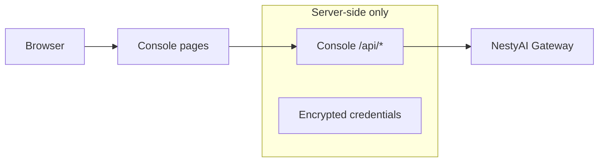

<p align="center">
  
</p>

<p align="center">
  <strong>Nesty Console</strong><br/>
  Next.js admin UI for operating a running NestyAI Gateway — chat, diagnostics, memory, model configs, and API keys.
</p>

<p align="center">
  
  
  
  
  
  
  
  
</p>

<p align="center">
  <strong>Operate your gateway.</strong> Keep secrets on the server.
</p>

---

## Overview

Nesty Console is a **separate frontend/admin project** from [NestyAI Gateway](../NestyAI). It does not embed Gateway logic — every Gateway call goes through **same-origin Console API routes** so API keys, internal admin tokens, and provider secrets never reach the browser.

Designed for self-host and panel-style deployments (local Node, VPS, Vercel with Redis KV or env-only fallback).

| | |
| --- | --- |
| **Console** | Next.js App Router UI + protected `/api/*` proxies |
| **Gateway** | Runs separately; OpenAI-compatible `/v1` API |
| **Auth** | Single-admin login, signed HTTP-only session cookie |
| **Secrets** | Encrypted server-side storage (SQLite, Redis KV, or env fallback) |

---

## What You Get

| Area | Console surface |
| --- | --- |
| **Chat** | Streaming/non-stream chat, conversation sidebar, presets, safe metadata panel |
| **Workspaces** | Local-first project hub (`localStorage`), notes, deep links, context injection |
| **Diagnostics** | Provider health, reliability, manual checks (internal admin) |
| **Model configs** | Safe runtime provider-chain overrides |
| **Memory** | Conversation search, export, summarize, message memory controls |
| **API keys** | Create, list, update, revoke Gateway keys (one-time raw key display) |
| **Settings** | Gateway URL, API key, internal admin token, runtime providers, connection test |
| **Status / Models** | Health, readiness, published model aliases |

Full release history: **[CHANGELOG.md](CHANGELOG.md)**

---

## Current Release — v0.10.2

**Gateway v1.6 Built-in Provider Credentials Sync**

| Feature | Detail |
| --- | --- |
| Built-in providers | Credential save/rotate/delete/test on `/settings/providers` (immutable definitions) |
| Admin token | Gateway-side rotate panel with disconnect warning; Console token not auto-updated |
| Console APIs | Proxies for `/internal/console/runtime/builtin-providers/*` and `/internal/console/security/admin-token/*` |
| Catalog sync | Model Configs merges built-in + runtime providers with credential warnings |
| Error sync | v1.6 `provider_credentials_*`, `builtin_provider_not_found`, `admin_token_rotation_unsupported` |

**v0.10.1** — Runtime provider management sync patch. See [CHANGELOG.md](CHANGELOG.md).

**v0.9.3** — Gateway v1.5 runtime provider and policy sync. See [CHANGELOG.md](CHANGELOG.md).

**v0.9.2** — Provider observability polish (rate-limit reset metadata, request ID copy). See [CHANGELOG.md](CHANGELOG.md).

**v0.9.0** — Earlier product UI rebuild.

---

## Architecture



- Browser calls **Console** routes only (`/api/gateway/*`, `/api/internal/*`, `/api/chat/completions`).
- Gateway credentials and internal admin tokens are resolved **server-side** before each upstream request.
- Chat streaming: SSE passthrough from Gateway; pre-stream errors return Console JSON envelopes.

---

## Quick Start

### 1) Install

```bash
pnpm install
```

### 2) Configure

```bash
copy .env.local.example .env.local
```

Minimum for local dev:

| Variable | Purpose |
| --- | --- |
| `NESTY_CONSOLE_ADMIN_USERNAME` | Login username (default `admin`) |
| `NESTY_CONSOLE_ADMIN_PASSWORD` | Login password |
| `NESTY_CONSOLE_SESSION_SECRET` | Session cookie signing secret |
| `NESTY_CONSOLE_CREDENTIALS_SECRET` | Encrypt stored Gateway secrets in UI |
| `NESTY_GATEWAY_URL` | Optional env fallback for Gateway base URL |
| `NESTY_API_KEY` | Optional env fallback for Gateway API key |
| `NESTY_INTERNAL_ADMIN_TOKEN` | Optional stable internal admin token |

### 3) Run

```bash
pnpm run dev
```

Open `http://localhost:3000`, sign in, then configure **Settings → Gateway Credentials** and run **Test connection**.

### 4) Verify build

```bash
pnpm run lint
pnpm run build
```

Optional supplementary validation (Node 22+ strip-types):

```bash
pnpm run validate:provider-parsers
```

---

## Main Routes

| Route | Description |
| --- | --- |
| `/login` | Single-admin authentication |
| `/chat` | Gateway chat with streaming, conversations, workspace context |
| `/workspaces` | Local project hub, import/export, deep links |
| `/diagnostics` | Provider health dashboard |
| `/model-configs` | Runtime model config overrides |
| `/memory` | Conversation and memory management |
| `/api-keys` | Gateway API key administration |
| `/models` | Published model aliases from Gateway |
| `/status` | Gateway health / readiness |
| `/settings` | Console settings overview |
| `/settings/gateway` | Gateway credentials manager |

---

## Deploying

### Local / VPS (SQLite)

Default storage: encrypted credentials in `data/nesty-console.db`. Set `NESTY_CONSOLE_CREDENTIALS_SECRET` before saving secrets in the UI.

### Vercel + Upstash Redis (recommended serverless)

1. Add Upstash Redis integration on Vercel.
2. Set `UPSTASH_REDIS_REST_URL`, `UPSTASH_REDIS_REST_TOKEN`.
3. Set `NESTY_CONSOLE_CREDENTIAL_STORAGE=auto` and `NESTY_CONSOLE_CREDENTIALS_SECRET`.
4. Redeploy, then save credentials at `/settings/gateway` (no redeploy needed for key rotation).

| Mode | When |
| --- | --- |
| `auto` | Redis KV if Upstash env present; else `env_only` on Vercel or `sqlite` locally |
| `redis_kv` | Force Upstash encrypted storage |
| `sqlite` | Local/VPS Node with writable filesystem |
| `env_only` | No persistent storage; UI save disabled; use env vars only |

Force env-only locally:

```env
NESTY_CONSOLE_DISABLE_CREDENTIAL_STORAGE=true
```

### Ephemeral Console key flow (panels / containers)

1. Start Gateway and copy `nsk_console_...` from startup logs.
2. **Settings → Gateway Credentials** → paste and save.
3. After Gateway restart, update the key when Console shows invalid/revoked warnings.

---

## Credential Priority

For every Gateway proxy call:

1. **Stored** encrypted credentials (SQLite or Redis KV)
2. **Environment** fallback (`NESTY_GATEWAY_URL`, `NESTY_API_KEY`, …)
3. Structured `credentials_not_configured` if still missing

---

## Internal Admin

Required on **Gateway**:

```env
INTERNAL_ADMIN_ENABLED=true
NESTY_INTERNAL_ADMIN_TOKEN=<shared-token>
```

Required on **Console** (env or Settings UI):

```env
NESTY_CONSOLE_ENABLE_INTERNAL_ADMIN=true
NESTY_INTERNAL_ADMIN_TOKEN=<same-token>
```

Enables `/diagnostics`, `/model-configs`, `/memory` semantic recall test, and `/api-keys`.

---

## Security Model

| Rule | Implementation |
| --- | --- |
| No secrets in browser | Gateway key, admin token, passwords stay server-side |
| Raw API keys | Shown once at creation; never in list/detail/revoke views |
| Proxy only | Pages call same-origin `/api/*`; no direct Gateway URLs from client JS |
| Encryption at rest | AES-256-GCM with `NESTY_CONSOLE_CREDENTIALS_SECRET` |
| Session | HTTP-only cookie, `sameSite=lax`, `secure` in production |
| Workspace data | Local `localStorage` only; do not store secrets in notes/prompts |
| Request IDs | Sanitized diagnostic metadata in error UI, not treated as secrets |

Generate strong secrets:

```bash
node -e "console.log(require('crypto').randomBytes(32).toString('base64url'))"
```

---

## API Surface (Console)

### Auth

| Method | Path |
| --- | --- |
| `POST` | `/api/auth/login` |
| `POST` | `/api/auth/logout` |
| `GET` | `/api/auth/me` |

### Chat

| Method | Path |
| --- | --- |
| `POST` | `/api/chat/completions` → Gateway `/v1/chat/completions` (stream + JSON) |

### Gateway credentials

| Method | Path |
| --- | --- |
| `GET` | `/api/console/gateway-credentials` |
| `POST` | `/api/console/gateway-credentials` |
| `DELETE` | `/api/console/gateway-credentials` |
| `POST` | `/api/console/gateway-credentials/test` |

### Gateway proxy (authenticated)

`GET /api/gateway/health`, `/ready`, `/models`, conversation routes under `/api/gateway/conversations/*`

### Internal admin proxy (authenticated)

`/api/internal/diagnostics/*`, `/api/internal/model-configs/*`, `/api/internal/embeddings/recall-test`, `/api/internal/api-keys/*`

---

## Design System

**Neural Noir** — dark mission-control aesthetic for Gateway operations.

| Token | Usage |
| --- | --- |
| Typography | Chakra Petch · JetBrains Mono · DM Sans |
| Accents | Cyan active states · green/amber/red status · violet memory/AI |
| Stack | Next.js App Router · TypeScript · Tailwind CSS · lucide-react |

---

## QA Checklist (smoke)

- [ ] Login / logout
- [ ] Gateway credentials test from Settings
- [ ] Chat stream and non-stream
- [ ] Conversation sidebar list / open / search
- [ ] Diagnostics and Model Configs (with internal admin)
- [ ] API key create (one-time raw key) / revoke
- [ ] Protected APIs return `401` when signed out
- [ ] No secrets in browser network responses or UI detail panels

---

## Relationship to NestyAI Gateway

| Project | Role |
| --- | --- |
| [NestyAI](../NestyAI) | Backend Gateway (FastAPI, OpenAI-compatible API) |
| **NestyConsole** | Admin UI + server-side proxies |
| DeskMart / others | Separate ecosystem apps — not bundled here |

Console targets **Gateway v1.5.2** runtime provider, policy, and provider error envelopes. Run a matching Gateway version for full error UX parity.

---

## Ops Note

Single-admin, self-host focused. Use reverse-proxy and network controls; do not expose admin surfaces to the public internet without restriction.

---

## Roadmap

| Version | Status |
| --- | --- |
| v0.4–v0.6 | Diagnostics, model configs, memory, Neural Noir shell |
| v0.7 | API Key Management UI |
| v0.8 | Workspaces, deep links, GSAP motion, scroll stability |
| v0.9.0 | Product UI rebuild |
| v0.9.1 | Gateway v1.3.1 provider sync |
| v0.9.3 | Gateway v1.5 runtime provider and policy sync |
| **v0.10.2** | **Gateway v1.6 built-in provider credentials sync (current)** |
| v0.10.1 | Runtime provider management sync patch |
| Later | X-RateLimit-Limit/Remaining UI; extended SSE metadata |

Enterprise marketplace workflows remain out of scope unless explicitly planned later.
